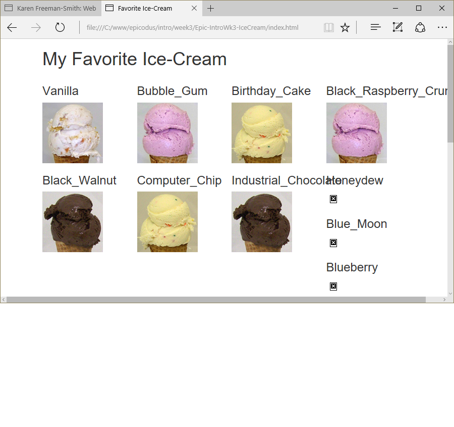

# Ice Cream Flavors
Version 0.0.1: August 15, 2016
by [Karen Freeman-Smith](https://karenfreemansmith.github.io) and [Angela Smith](https://github.com/avksmit2)

### Technologies Used
HTML, CSS, Bootstrap, JavaScript, jQuery

## Description
*[Epicodus](http://epicodus.com) Intro to Programming Week 3 Pair Project with Angie Smith: Builds a webpage for your favorite ice cream flavors using loops and arrays.*

## Setup/Installation
* [View on Github Pages](https://karenfreemansmith.github.io/Epic-IntroWk3-IceCream)
* _OR_
* Clone directory
* Open index.html in your favorite browser

## Support & Contact
For questions, concerns, or suggestions please email karenfreemansmith@gmail.com

## Known Issues
* None

## Legal
*Licensed under the GNU General Public License v3.0*

Copyright (c) 2016 Copyright _[Karen Freeman-Smith](https://karenfreemansmith.github.io)_ All Rights Reserved.
